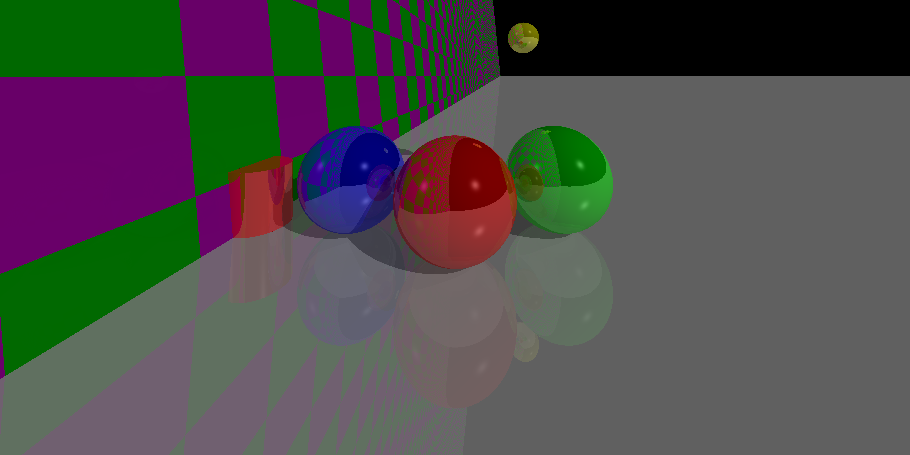
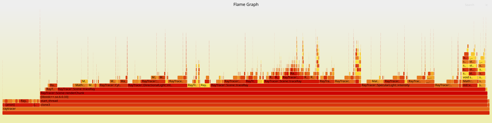

# Ray Tracer

Here is a current example of what it looks like:




## Description

This is an efficient raytracer written in C++.

Currently supports:
- Shapes
  - Spheres
  - Planes
  - Cylinders
- Lights
  - Specular
  - Directional
  - Ambient

## Build

Requires clang++ and libconfig++ (for example: `libconfig++-dev`).

```sh
make
```

## Usage

The renderer reads `scene_config.cfg` and writes a PPM image to stdout. For now, use:

```sh
./raytracer > output.ppm ; rm output.png; ffmpeg -i output.ppm output.png -loglevel quiet
```

## Performance

Here is a flame graph.




It can currently run 8000*4000 at 4 max depth in about 13 seconds on my machine. This is with no multithreading, so there is definitely room for improvement.

## How it works

The parser loads the scene configuration, builds a `Scene` with a camera, shapes, and lights, and then renders it. For each pixel, the camera emits a ray, the renderer finds the closest intersection, and gathers light contributions from ambient, directional, and specular lights. Reflective surfaces spawn additional rays up to a maximum recursion depth to approximate reflections. The final image is written as an ASCII PPM stream.
